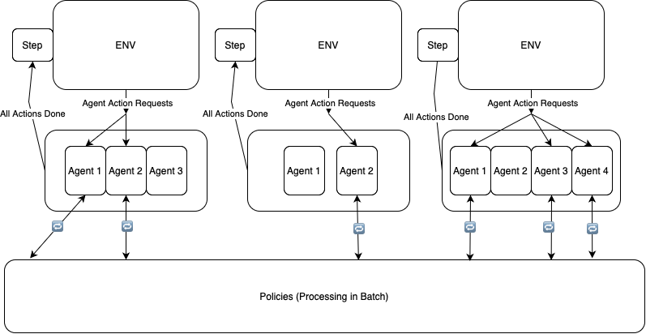

=================
Abstract Standard for Multi-Agent Negotiation Environments
=================

Multi-Agent Negotiation Environments require more features than gymnasium environments in order to be used as interfaces in general game running code. 
The two fundamental differences between gymnasium environments and Multi-Agent Negotiation Environments are:

1. Response from the LLM is a text action, not a discrete action. Therefore, appropriate parsing of the text is required. The model may need to be run multiple times to get the full action.
    This is why we introduce the `AgentHandler` class, which is responsible for parsing the LLM's response.
2. The environment needs to be able to handle multi-agent interactions.
    This is why we introduce the `NegotiationEnvironment` class, which is responsible for handling the multi-agent interactions.
3. MARL environments are complex to describe. In different contexts, the same environment may be described differently. Therefore, both the environement and the agent handlers are 
    responsible for describing a particular trajectory. This information is given by the `get_log_info` method. 
4. There might be a lot of overlap between the neural networks used by each agent. For instance, the same model may be used for all agents. This motivates a requirement for a
    policy identifier for each agent.

Taking inspiration from the `gymnasium <https://gymnasium.farama.org/>`_ library, we introduce a new standard for Multi-Agent Negotiation Environments. 

Our standard is based on the following features:

Environments are of the form:

.. code-block:: python

    class MarlEnvironment():

        def __init__(self):
            """Initialize the environment."""
            pass

        def reset(self):
            """Reset the environment to an initial state and return the initial observation.
            Returns:
                observation (dict): A dictionary where keys are agent identifiers and values are observations.
            """
            # (...)
            return observation

        def step(self, actions):
            """Take a step in the environment using the provided actions.

            Args:
                actions (dict): A dictionary where keys are agent identifiers and values are actions.

            Returns:
                observations (dict): A dictionary where keys are agent identifiers and values are observations.
                reward (dict): A dictionary where keys are agent identifiers and values are rewards.
                done (bool): Whether the episode has ended.
                info (dict): Additional information about the environment.
            """
            # (...)
            return observations, done, info

        def get_log_info(self):
            """Get additional information about the environment. This information is used to log the game.
            Returns:
                log_info (dict): Information about the environment required to log the game.
            """
            # (...)
            return log_info

        def render(self):
            """Render the current state of the environment."""
            pass

        def close(self):
            """Perform any necessary cleanup."""
            pass

    class AgentState():

        def __init__(self):
            """Initialize the agent state."""
            pass

        def step(self, observation_from_env, policy_output=None):
            """Update the agent state based on the observation and action. 
            The action is the output of the LLM.
            """

            Args:
                observation_from_env (dict): The observation of the environment. 
                policy_output : The output of the policy.

            Returns:
                policy_id (str): The policy identifier.
                policy_input (dict): The input to the policy.
                action : The official action to be sent to the environment.
                done (bool): Whether the LLM action is ready to be sent to the environment.
                info (dict): Additional information about the agent.
            """
            # (...)
            return policy_id, policy_input, action, done, info

        def get_log_info(self):
            """Get information about the agent required to log a trajectory.
            Returns:
                log_info (dict): Information about the agent required to log a trajectory.
            """ 
            # (...)
            return log_info

        def render(self):
            """Render the current state of the environment."""
            pass

        def close(self):
            """Perform any necessary cleanup."""
            pass

Implicitely, the keys of the `observations` in the `step` method of the `MarlEnvironment` interface represent the set of agents from which an action is expected at the current step. The next step should only expect actions from the agents in the `observations` dictionary. 

As you can see, both classes have a `get_log_info` method. This method is used to log the game. It returns a dictionary with keys being the agent identifiers and values being the information to log. The reason we need this is because the environment and the agent handler may need to log different information. It makes it easier to log from the perspective of each agent. The core environment class should not need to know about the details of the agent handler.

Running Environments in Parallel
--------------------------------
This standard allows the use of the `run_batched_matches` function (TODO: link) to run environments in an efficient way. The core idea is to batch the policy calls for all agents in the environment. 

.. note:: 
   The ``run_batched_matches`` function allows you to run multiple negotiation games, or "matches," in parallel. 
   After each environment is initialized, the function continuously loops over all active matches and checks which agents
   are still pending actions. Each agent's logic can require multiple calls to the policy (e.g., an LLM) before an action 
   becomes "ready" to be sent to the environment. (For instance, an agent might need multiple policy calls before having a string which can be parsed into a valid action.) While an agent is waiting for a policy output, these calls for all agents across all matches are grouped together by unique policy identifier and processed in batch for efficiency. This is the core functionality of the ``run_batched_matches`` function.

   Only once all actions from the required agents at a given step for an environment are ready does the function make a single ``env.step(...)`` call; this ensures
   every match moves forward in lockstep for all its active agents. As soon as an environment signals it is done, the function 
   retrieves logged information from both the environment and the agent states before removing this match from the active set.

   If there are more matches waiting to be processed, they are then started one by one to maintain the specified degree of parallelism.
   This batching approach provides an efficient mechanism to handle multi-agent or multi-policy environments, ensuring minimal 
   overhead and a clear, unified flow for stepping through matches.

Here is a diagram that shows how the `run_batched_matches` function works at a high level:

